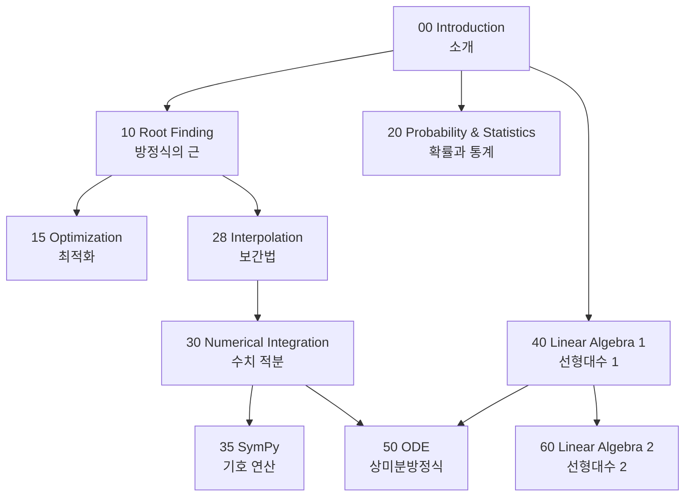

[](https://github.com/kangwonlee/nmisp/actions/workflows/conda_env_test.yml)

# 사이파이 수치 해석<br>Numerical Methods in SciPy

## 소개<br>Introduction

[](https://youtu.be/_GN74MRLYcI)

이 저장소는 다양한 수치 해법을 [`Python`](https://ko.wikipedia.org/wiki/%ED%8C%8C%EC%9D%B4%EC%8D%AC) 언어와 그 확장 기능인 `SciPy` 를 이용하여 설명하고자 함.<br>
This repository aims to describe various numerical methods in [`Python`](https://en.wikipedia.org/wiki/Python_%28programming_language%29) programming language and its extension `SciPy`.

## 과정 구성<br>Course Structure



| 폴더<br>Folder | 주제<br>Topic | 주요 내용<br>Key Contents |
|:---:|:---:|:---|
| `00_introduction` | 소개<br>Introduction | 부동소수점, 파이썬 복습<br>Floating point, Python review |
| `10_root_finding` | 방정식의 근<br>Root Finding | 순차, 이분법, 뉴턴-랩슨<br>Sequential, Bisection, Newton-Raphson |
| `15_optimization` | 최적화<br>Optimization | 커브피팅, 분류, 선형계획<br>Curve fitting, Classification, LP |
| `20_probability` | 확률 통계<br>Probability | 확률변수, 회귀, 판다스<br>Random variables, Regression, Pandas |
| `28_interpolation` | 보간법<br>Interpolation | 보간법<br>Interpolation |
| `30_num_int` | 수치 적분<br>Numerical Integration | 직사각형, 사다리꼴, 심프슨, 수렴 차수<br>Rectangle, Trapezoid, Simpson, Convergence order |
| `35_sympy` | 기호 연산<br>SymPy | 기호 연산, 보 반력<br>Symbolic math, Beam reaction |
| `40_linear_algebra_1` | 선형대수 1<br>Linear Algebra 1 | 벡터, 내적, 외적, 행렬<br>Vectors, Dot/Cross product, Matrix |
| `50_ode` | 상미분방정식<br>ODE | 오일러, 훈, 룽게-쿠타<br>Euler, Heun, Runge-Kutta |
| `60_linear_algebra_2` | 선형대수 2<br>Linear Algebra 2 | 연립방정식, 고유값, 가우스 소거<br>Systems of equations, Eigenvalues, Gauss elimination |

## [Google Colab](https://colab.research.google.com) 에서 실행하기<br>Running on [Google Colab](https://colab.research.google.com)

### 노트북 열기<br>Opening a notebook

1. 이 [저장소](https://github.com/kangwonlee/nmisp)의 `ipynb` 파일을 엶<br>Open an `ipynb` file of [this repository](https://github.com/kangwonlee/nmisp)
1.  클릭<br>Click on 
1. `런타임` 아래 `모두 실행` 시도<br>Try `Run all` under `Runtime`

### 변경 사항 저장하기<br>Saving changes to GitHub

1. 저장소의 [분기](https://github.com/kangwonlee/nmisp/fork) 사본을 만듦<br>[Fork](https://github.com/kangwonlee/nmisp/fork) the repository
1. 분기된 저장소에서 `ipynb` 파일을 엶<br>Open the `ipynb` file from the forked repository
1.  클릭<br>Click on 
1. 파일을 수정<br>Make changes
1. `파일` 메뉴 아래 `Github 에 사본 저장`<br>Choose `Save a copy in GitHub` under `File` menu

## 로컬 설치<br>Local Installation

### 요구 사항<br>Requirements

* [Git](https://git-scm.com/downloads)
* [Miniconda](https://docs.conda.io/en/latest/miniconda.html) 또는<br>or [Anaconda](https://www.anaconda.com/download)

### 설치 및 실행<br>Setup and Run

``` sh
git clone https://github.com/kangwonlee/nmisp
cd nmisp
conda env create -n nmisp -f ./tests/environment.2023.09.yml
conda activate nmisp
jupyter notebook
```

### 테스트 실행<br>Running Tests

``` sh
conda activate nmisp
pytest -n auto tests/
```

### 설치 동영상<br>Installation video
[](https://www.youtube.com/embed/videoseries?list=PLA6B0Lmr9oJNVqYMpfpbXxQCZxNrS1Xuo)

## 알림<br>Acknowledgement

* This software was initially supported by the Korea Ministry of Land, Infrastructure, and Transportation. It was also supported by the Korean Agency for Infrastructure Technology Advancement. (18TLRP-B117133-03)
<br>이 소프트웨어는 대한민국 국토교통부 건설교통과학기술진흥원 교통물류연구사업의 지원을 받아 시작되었음. (18TLRP-B117133-03)
* Also, this software got help from generative artificial intelligence : Google Gemini Advance and Anthropic Claude Opus 4.6 in improving the text and source code quality.
<br>또한, 이 소프트웨어는 문장과 코드 품질 향상을 위해 생성형 인공지능 구글 제미니 어드밴스와 앤스로픽 클로드 오퍼스 4.6의 도움을 받았음.
